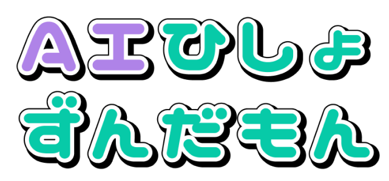
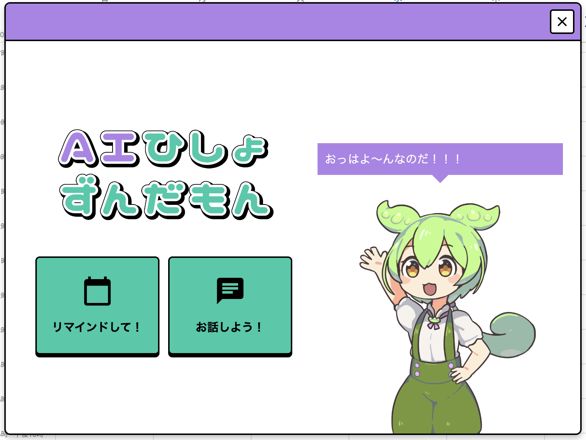
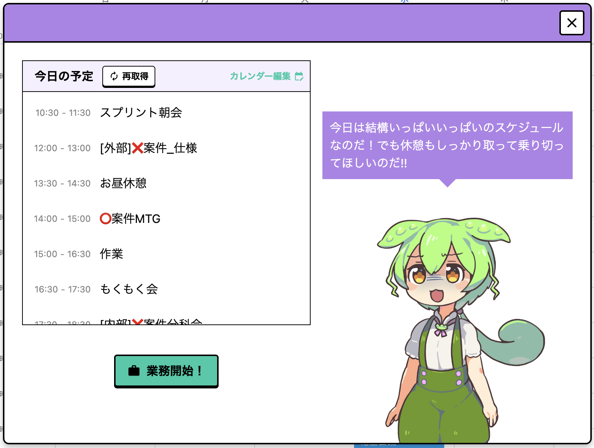
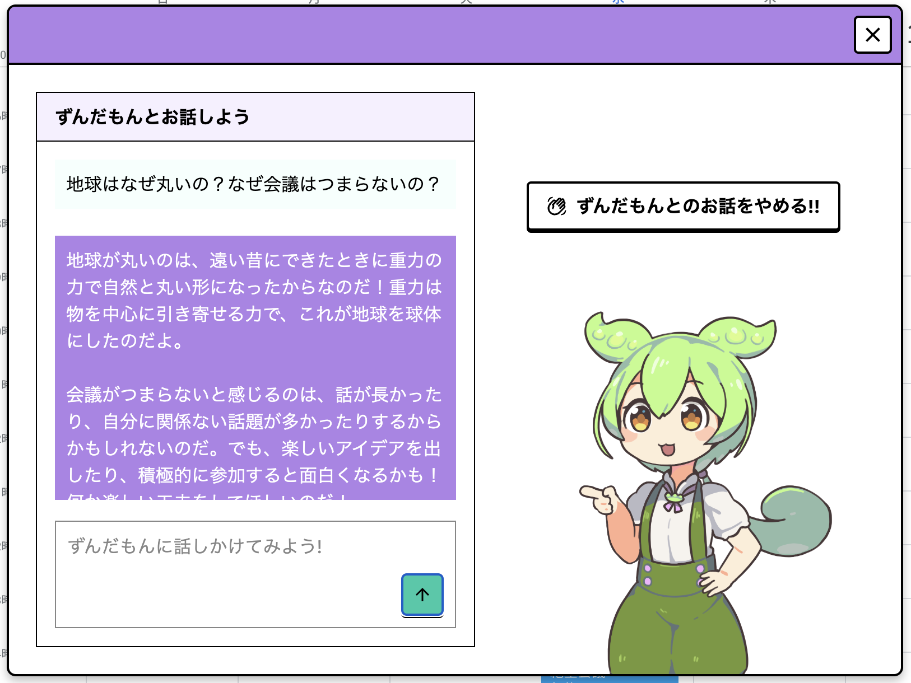
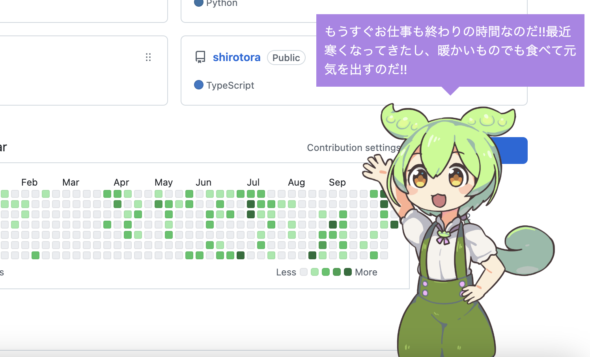
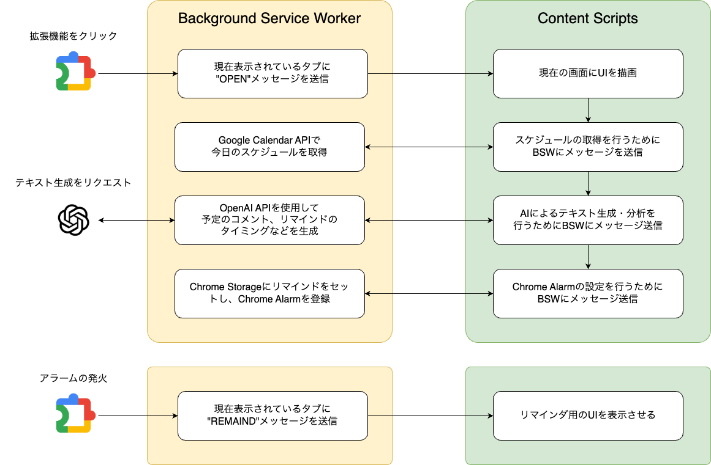

  

<h1 align="center">🍀 ai-secretary-zundamon 🍀</h1>

  

## 🎉 Overview

**ai-secretary-zundamon**は、「[ずんだもん](https://voicevox.hiroshiba.jp/product/zundamon/)」があなたの業務をサポートしてくれるChrome拡張機能です。

個人利用のためChrome ウェブストアにリリースはされていませんが、リポジトリから拡張機能をビルドすることで利用することが可能です。

### 🎥 [紹介動画はこちら!!](https://www.youtube.com/watch?v=F477FUzynJc)

## 🌟 Features

### ⭐️ ずんだもんに今日の予定をリマインドしてもらう!!

リマインド機能を使用して、ずんだもんに会議を忘れないように教えてもらうことができます!!

  

### ⭐️ ずんだもんとお喋りできる!!

チャット機能を使用して、ずんだもんと雑談することができます!!

  

### ⭐️ ずんだもんに労いの言葉を貰える!!

ずんだもんが稀にあなたを励ましてくれます!!これを支えに頑張りましょう!!

  

## 🤔 How it Works?

### 💡 Chrome拡張機能について

Chrome拡張機能の作成には、React + TypeScript + Tailwind CSSの構成で開発が可能な「[Plasmo](https://docs.plasmo.com/)」というフレームワークを使用しています。

 

  

 

API系の処理はセキュリティ上の観点からCORSポシリーにより阻止され、Content UIから直接呼び出すことができません。そのため、plasmoで提供されている`@plasmohq/messaging`を利用したメッセージングを通して処理を行っています。

また、Content Scriptsにおいては、SWRやTanstack Queryなどのフェッチ系ライブラリ、Framer Motionなどのアニメーションライブラリなどが使用できません。今回はカスタムフックや[react-spring](https://www.react-spring.dev)などのライブラリを使用して回避しています。

### 💡 AIモデルについて

AIモデルにはOpenAIの`gpt-4o`を使用しており、チャット/コメントなどのテキスト生成、Preview版の機能である[Structured Output](https://platform.openai.com/docs/guides/structured-outputs)を使用した追加リマインダの生成などを行っています。

> [!NOTE]
> 現在は`.env`ファイルにOpenAIのAPI Keyを環境変数としてエクスポートすることで、Chrome拡張機能内でAIを利用できるようにしています。

### 💡 Google Calendar APIについて

リマインダの元となるスケジュールは**Google Calendar**から取得を行います。現在の公開ステータスは「テスト」段階であるため、特定のユーザのみ認証が可能な状態となっています。

> [!NOTE]
> 手動でビルドを行う場合は、Google Cloud PlatformからAPIのOauthクライアントを作成し、`package.json`のプロパティを適切に変更する必要があります。

## 🛠️ Developers

<table>
  <tr>
    <td align="center">
      <a href="http://www.yanoucrea.fr">
        
         
        <b>874wokiite</b>
      </a>
       
      🎨
      💻
      📖
    </td>
    <td align="center">
      <a href="http://www.yanoucrea.fr">
        
         
        <b>tosuri13</b>
      </a>
       
      🤖
      💻
      📖
    </td>
  </tr>
</table>
